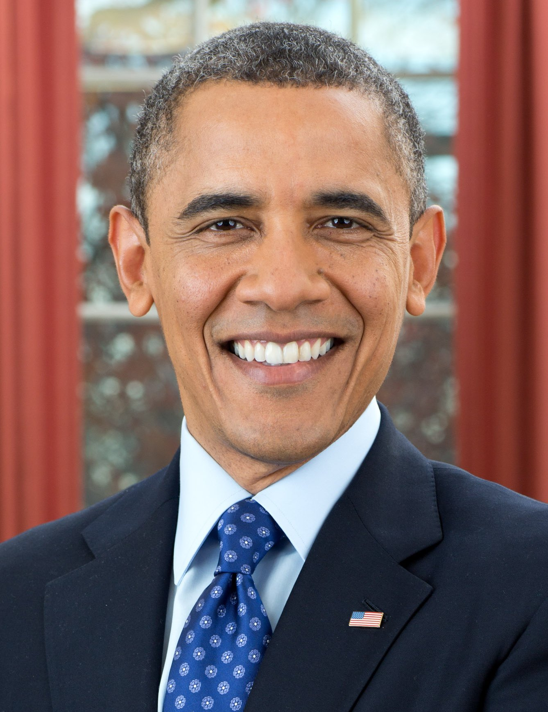
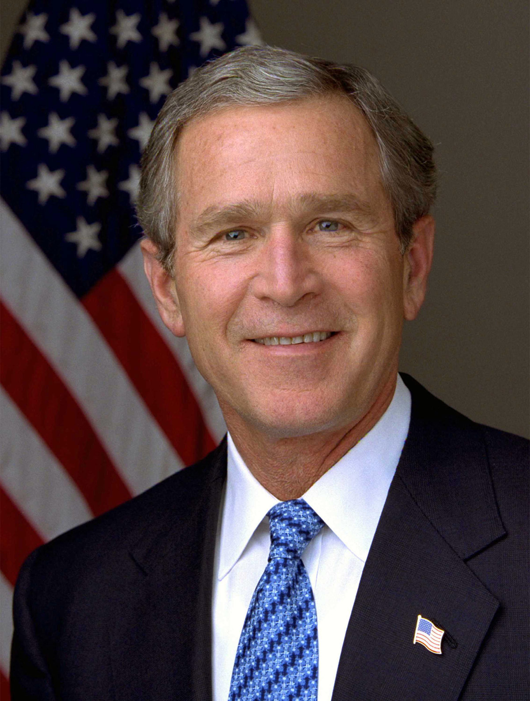
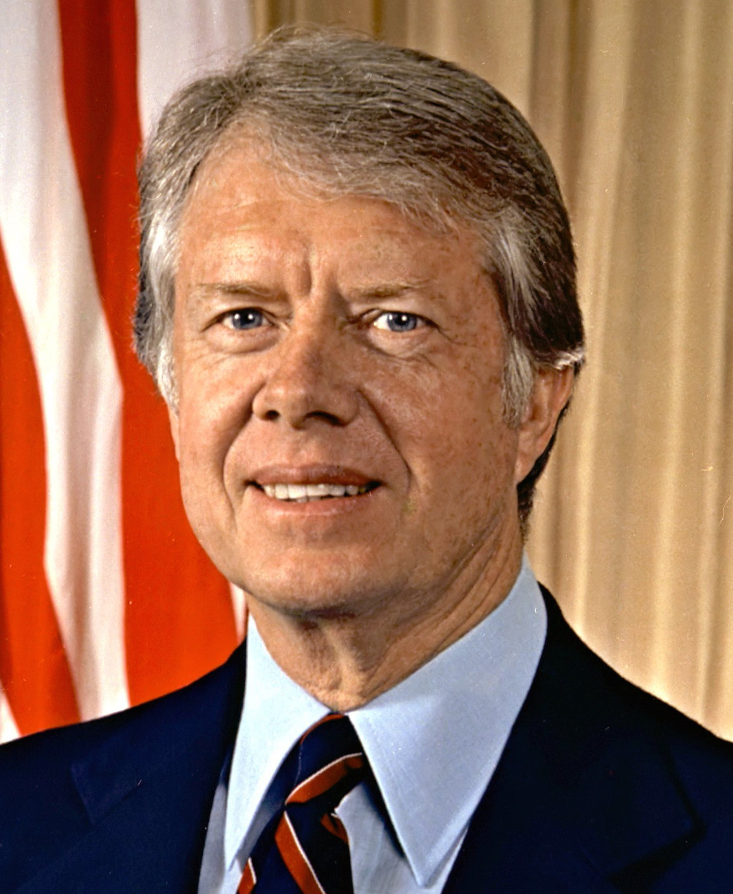
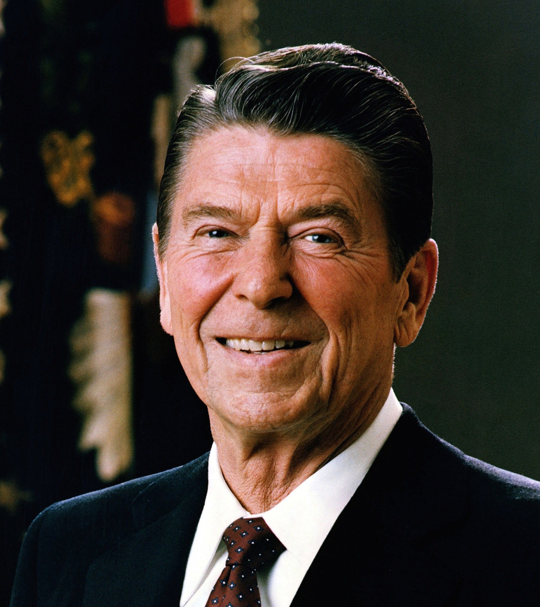
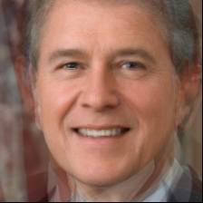

# Average Face

The function of this tool is to generate the average face of a bunch of faces.

## 1. What's the concept of average face?

Thanks to Satya Mallick's blog: [https://learnopencv.com/average-face-opencv-c-python-tutorial/](https://learnopencv.com/average-face-opencv-c-python-tutorial/)

## 2. Requriments

```shell
cmake==3.22.0
numpy==1.21.4
scikit-image==0.19.0
dlib==19.22.1
opencv-python==4.5.4.60
```

Note: only support opencv version 4, other version need to rectify the function `cv2.estimateAffinePartial2D` in file `face_average.py`.

## 3. Usage

Please see file [tutorial.ipynb](./tutorial.ipynb) for more details.

## 4. Visulization Results

test images:

| | | |
|-------|---------------|-----|
|  |  |  |
|  |  |  |

average image:



## Acknowledge

This code is build from [Naurislv](https://github.com/Naurislv)'s project: [https://github.com/Naurislv/facial_image_averaging](https://github.com/Naurislv/facial_image_averaging)