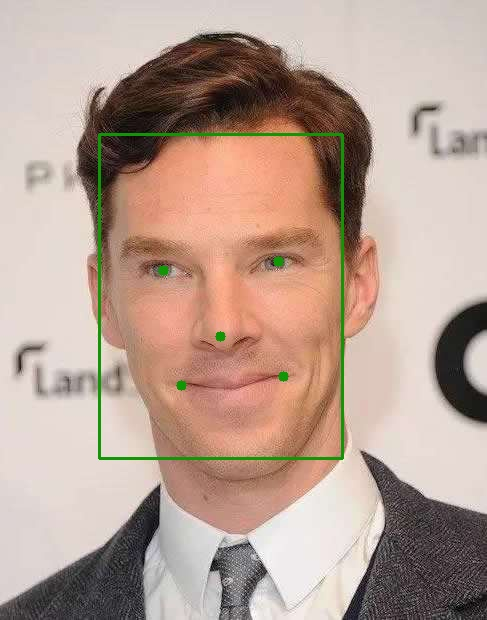
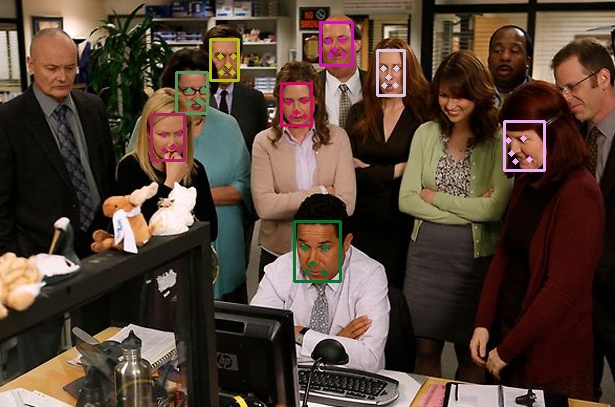

# Face Recognition

This is a pytorch-based face recognition code implementation.

I highly recommend the insightFace project: [https://github.com/deepinsight/insightface/](https://github.com/deepinsight/insightface/)

Here I only provide a set of simple implementation, trying to explain the general face recognition algorithm training process.

## 1. What's face recognition?

Face recognition tasks are similar to classification tasks. When give you a face, the face recognition network need to recognize the identity of the face ID.

Usually we also called face identification, usually mean the rank-1 face identification accuracy.

## 2. Processing of Face Identification

### 2.1 Face Detection

First, we need to detect a face in the image, usually we will use **MTCNN** to detect the bounding box of the face and the landmark. For more details about the face detection algorithm **MTCNN** is described in

[Joint Face Detection and Alignment using Multi-task Cascaded Convolutional Networks](https://arxiv.org/abs/1604.02878).

The official MTCNN is here: [https://github.com/kpzhang93/MTCNN_face_detection_alignment](https://github.com/kpzhang93/MTCNN_face_detection_alignment)

I recommand two implementation, one is TensorFlow base: [https://github.com/ipazc/mtcnn](https://github.com/ipazc/mtcnn);
Another is PyTorch based: [https://github.com/TropComplique/mtcnn-pytorch](https://github.com/TropComplique/mtcnn-pytorch)

Because we use PyTorch framework, so I offer a tool in this project.

Please see [tutorial_face_detect_landmark.ipynb](./tutorial_face_detect_landmark.ipynb) for more details.

An example:

|   |   |
|---|---|
|||
|||

### 2.2 Face Alignment

Face alignment is crutial for face identification.

Please see [tutorial_face_alignment.ipynb](./tutorial_face_alignment.ipynb) for more details.

An example:

